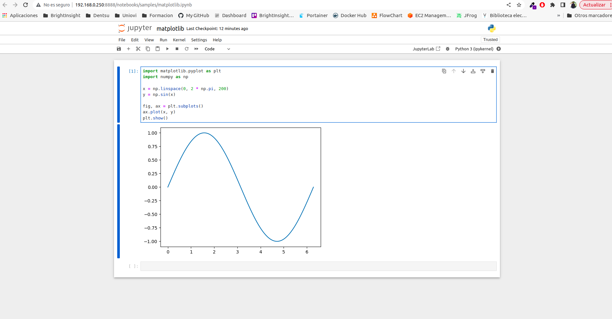

# Description
PoC Virtual Environment for Jupyter Remote Mode

## Steps

**STEP01**: create a virtual Python environment called avib:

```shell
python3 -m venv avib
```

**STEP02**: activate the python virtual environment:

```shell
source avib/bin/activate                                      
```

**STEP03**: install python dependencies inside the virtual python environment activated

```shell
pip3 install numpy
pip3 install pandas
pip3 install matplotlib
pip3 install jupyter
```

**STEP04**: start jupyter in remote mode:

```shell
jupyter notebook --no-browser --ip="192.168.0.250" --port=8888
```

**STEP05**: deactivate the virtual environment:

```shell
deactivate
```



